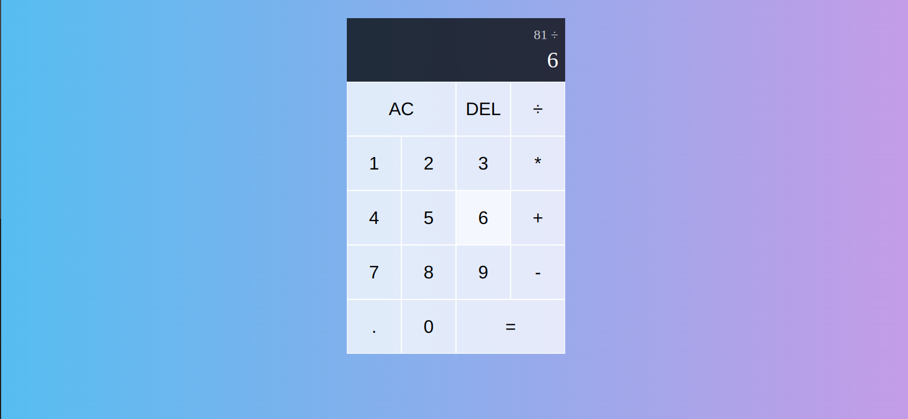

# Simple React Calculator

This is a simple calulator application website built in using React app
.

<div align="center">
    
</div>

### Built With

- [![React][React.js]][React-url]
- [![Javascript]][Javascript-url]

## Getting Started

This is an example of how you may give instructions on setting up your project locally.
To get a local copy up and running follow these simple example steps.

### Prerequisites

First You have to have the latest npm version to run the react app.

- npm
  ```sh
  npm install npm@latest -g
  ```

### Installation

_Below is an example of how you can instruct your audience on installing and setting up your app. This template doesn't rely on any external dependencies or services._

1. Clone the repo
   ```sh
   git clone https://github.com/DanielJohn17/Simple-react-calculator.git
   ```
2. Cd to calculator directory
   ```sh
   cd calculator
   ```
3. Install NPM packages
   ```sh
   npm install
   ```
4. Run the React app
   ```sh
   npm run dev
   ```

### Author

- Daniel Yohannes

## Acknowledgments

- #### Web Dev Simplified
  - <a href="https://www.youtube.com/@WebDevSimplified"> Youtube Link </a>

[React.js]: https://img.shields.io/badge/React-20232A?style=for-the-badge&logo=react&logoColor=61DAFB
[React-url]: https://reactjs.org/
[Javascript]: https://shields.io/badge/JavaScript-F7DF1E?logo=JavaScript&logoColor=abadb0&style=flat-square
[Javascript-url]: https://www.javascript.com/
